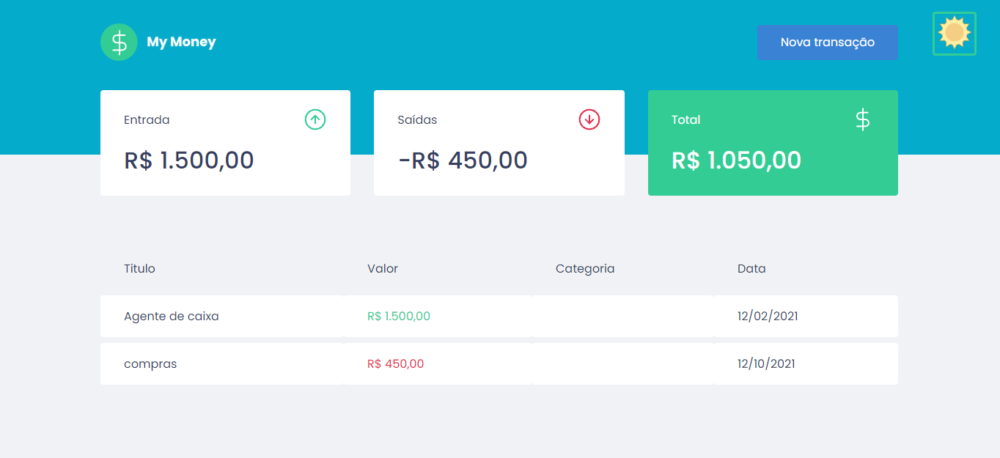
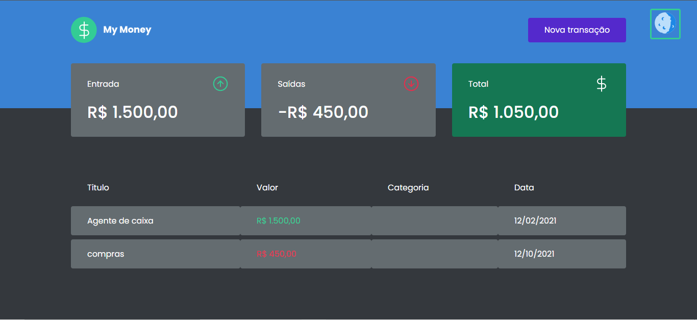

## My-Money

<h4>My-Money é um aplicativo web de finanças para praticar o que foi aprendido no curso de React ignit.</h4>
## My Money with both modes

 
 


This project was developed using web based technologies.


- [Reactjs](https://reactjs.org/)
- [Styled-components](https://styled-components.com/)

## 💻 Getting started

### Requirements
Browser

**Clone the project and access the folder**

```bash
$ git clone https://github.com/BrunoFerreiraDev/my-money.git && cd my-money
```

**Follow the steps below**

in the terminal, run yarn start


Made  by Bruno Ferreira 👋 [Check out my LinkedIn](https://www.linkedin.com/in/bruno-ferreira-santos-6b2428214/)